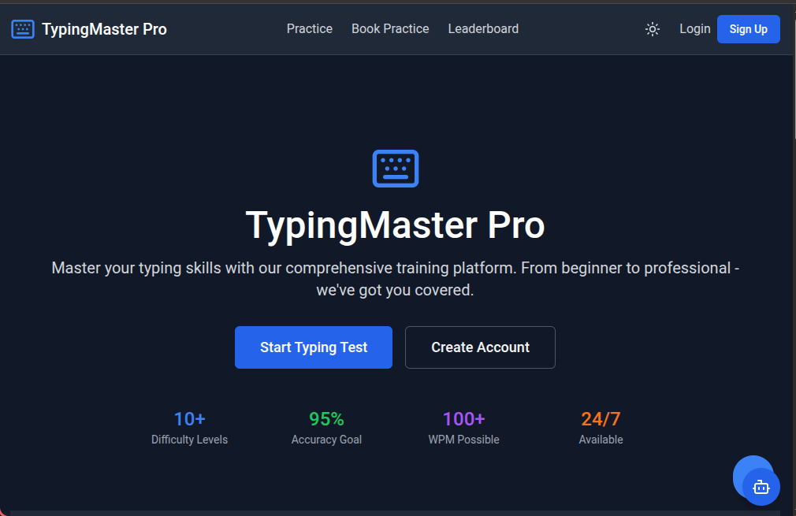
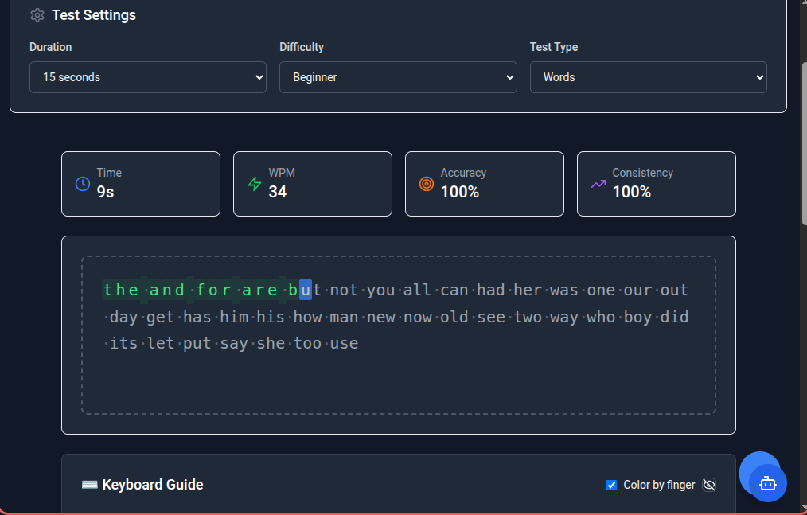
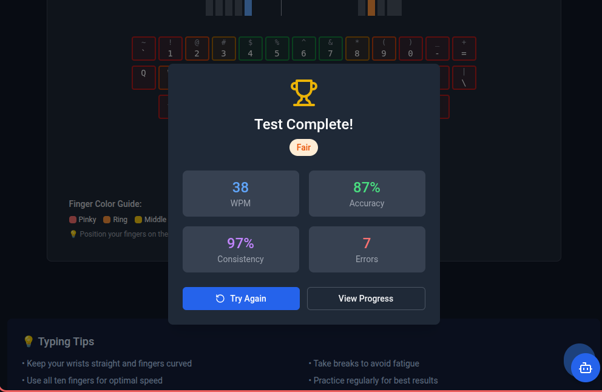

# TypingMaster Pro - Advanced Typing Training Platform

🚀 **A comprehensive, professional-grade typing speed test application with real book content, multi-source fetching, and advanced analytics.**

[](https://www.typescriptlang.org/)
[](https://reactjs.org/)
[](https://nodejs.org/)
[](https://expressjs.com/)
[](https://tailwindcss.com/)

## 📸 Screenshots

### 🏠 Home Page & Main Interface
<div align="center">
  
</div>

*Modern, clean interface with real-time typing test*

### 📚 Book Practice Mode
<div align="center">
  
</div>

*Practice with real classic literature and chapter navigation*

### 📊 Advanced Features
<div align="center">
  
</div>

*Comprehensive analytics, progress tracking, and professional features*

## 🔗 Live Demo

> **Note**: Replace this section with your actual deployment URL once deployed

🌐 **Live Application**: [https://typingmaster-pro.vercel.app](https://typing-master-pro-eta.vercel.app/)

Try the application live with:
- ✅ Real book content from multiple sources
- ✅ Chapter navigation through classic literature  
- ✅ Advanced analytics and progress tracking
- ✅ Global leaderboards and achievements
- ✅ Responsive design for all devices

## ✨ Key Features

## 🚀 Quick Start

### Prerequisites
- Node.js 18+ and npm
- Git

### Installation

1. **Clone the repository**:
   ```bash
   git clone https://github.com/Daniel-wambua/TypingMaster-Pro.git
   cd TypingMaster-Pro
   ```

2. **Install dependencies**:
   ```bash
   # Install all dependencies (client + server)
   npm run install:all
   
   # Or install individually
   cd client && npm install
   cd ../server && npm install
   ```

3. **Setup database**:
   ```bash
   npm run setup
   ```

4. **Start development servers**:
   ```bash
   # Start both client and server
   npm run dev
   
   # Or start individually
   # Terminal 1: Backend
   cd server && npm run dev
   
   # Terminal 2: Frontend  
   cd client && npm run dev
   ```

5. **Open your browser** to `http://localhost:5173`


## 🔧 Configuration

### Environment Variables

Create `.env` files in both `client/` and `server/` directories:

**server/.env**:
```env
PORT=3002
DATABASE_URL="file:./dev.db"
JWT_SECRET="your-secret-key"
NODE_ENV="development"
```

**client/.env**:
```env
VITE_API_BASE_URL="http://localhost:3002"
```

## 📈 Content Sources

The application uses multiple sources for maximum reliability:

1. **Primary Sources**:
   - Internet Archive (most reliable)
   - Standard Ebooks (high quality)
   - Wikisource (comprehensive)

2. **Mirror Sites**:
   - Project Gutenberg Australia
   - Project Gutenberg Europe
   - Alternative repositories

3. **Fallback System**:
   - Intelligent retry mechanism
   - Enhanced sample content
   - 12-chapter structure maintenance

## 🧪 Testing

```bash
# Run all tests
npm run test

# Run frontend tests
cd client && npm test

# Run backend tests  
cd server && npm test

# Run with coverage
npm run test:coverage
```

## 🚀 Deployment

### Production Build

```bash
# Build for production
npm run build

# Preview production build
npm run preview
```

### Docker Deployment

```bash
# Build Docker image
docker build -t typingmaster-pro .

# Run container
docker run -p 3000:3000 typingmaster-pro
```

### Environment Setup

1. Set production environment variables
2. Configure database for production
3. Set up reverse proxy (nginx recommended)
4. Configure SSL certificates

## 🤝 Contributing

1. Fork the repository
2. Create a feature branch (`git checkout -b feature/amazing-feature`)
3. Commit your changes (`git commit -m 'Add amazing feature'`)
4. Push to the branch (`git push origin feature/amazing-feature`)
5. Open a Pull Request

## 📝 License

This project is licensed under the MIT License - see the [LICENSE](LICENSE) file for details.

## 🙏 Acknowledgments

- **Project Gutenberg** for providing free access to classic literature
- **Internet Archive** for reliable content hosting
- **Standard Ebooks** for beautifully formatted public domain books
- **Open Source Community** for the amazing tools and libraries

## 📞 Support

- 🐛 **Issues**: [GitHub Issues](https://github.com/Daniel-wambua/TypingMaster-Pro/issues)
- 💬 **Discussions**: [GitHub Discussions](https://github.com/Daniel-wambua/TypingMaster-Pro/discussions)

---

**Built with ❤️ by Havoc for the typing community**
 if the project inspired you or helped you in your typing journey, please consider giving a star ⭐ on GitHub!
